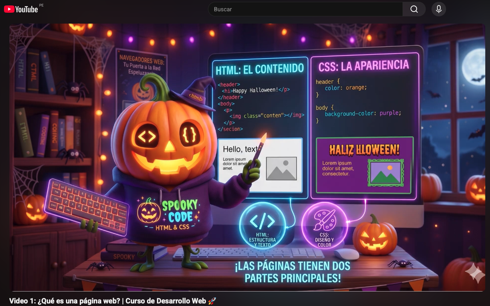
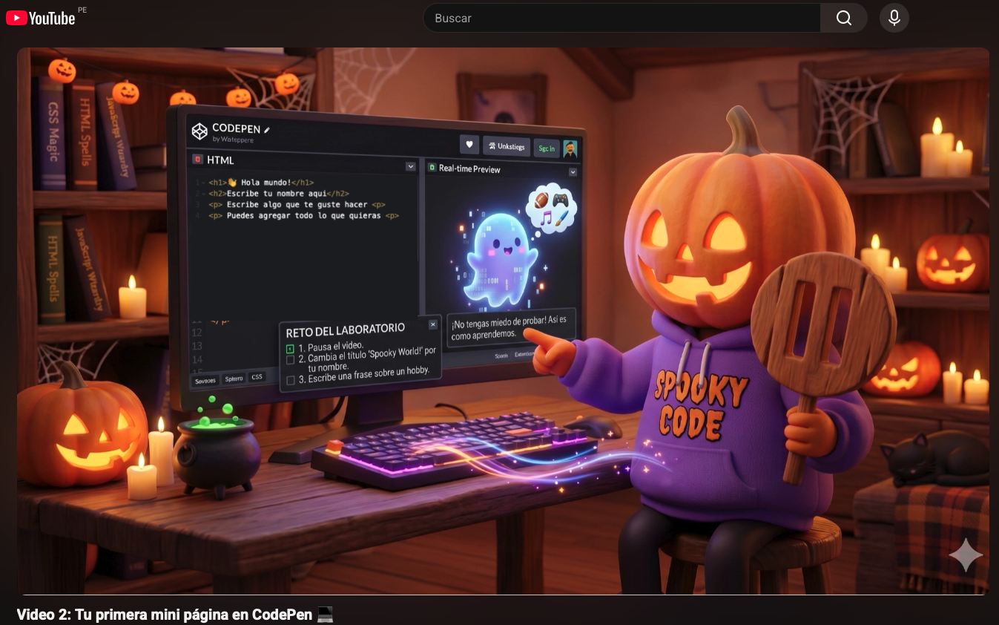
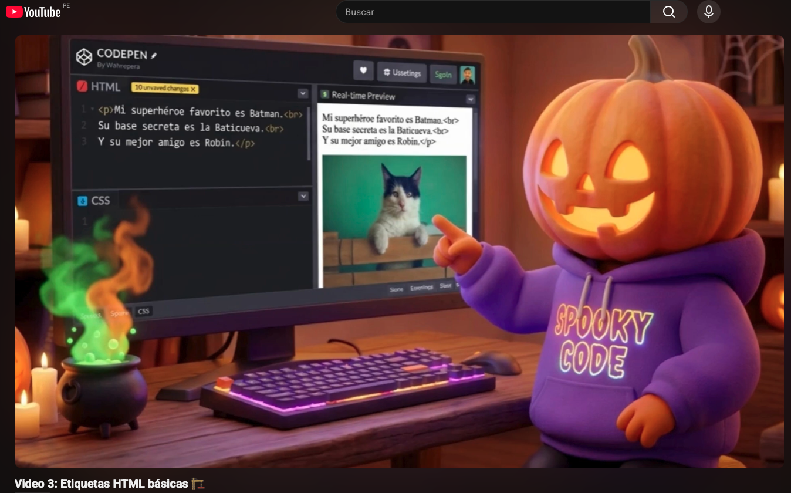
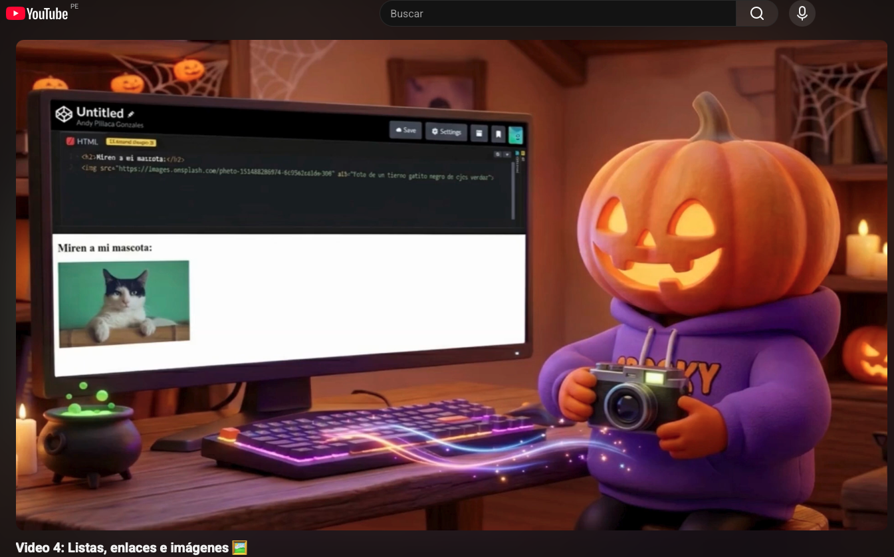
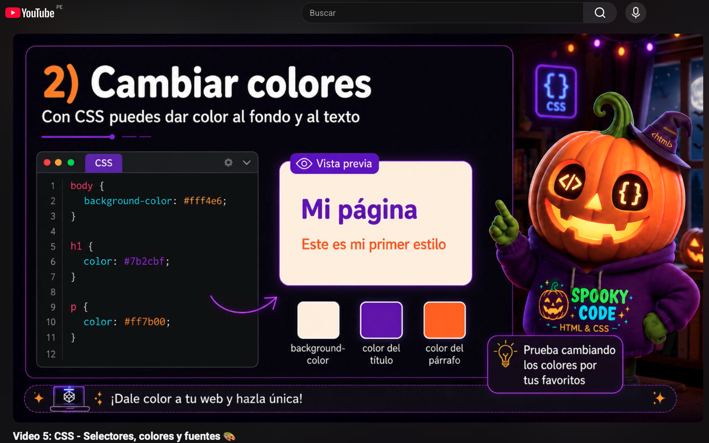
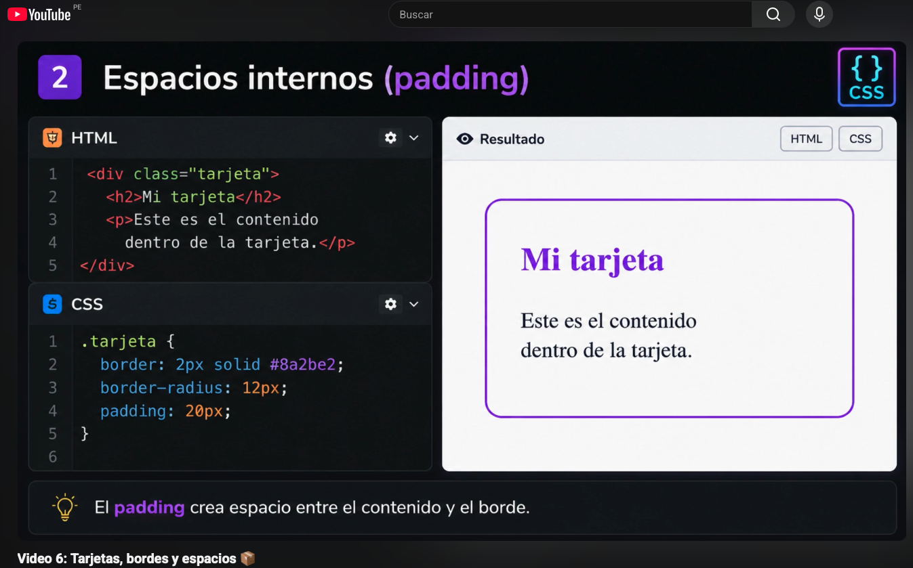
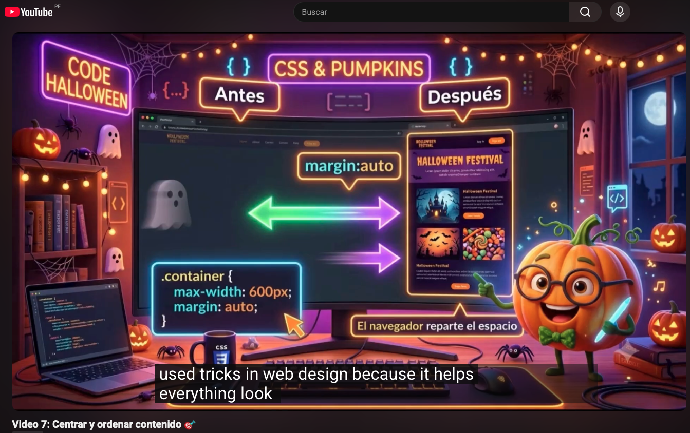
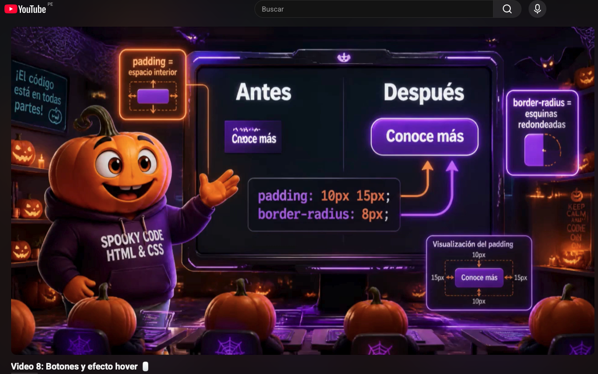
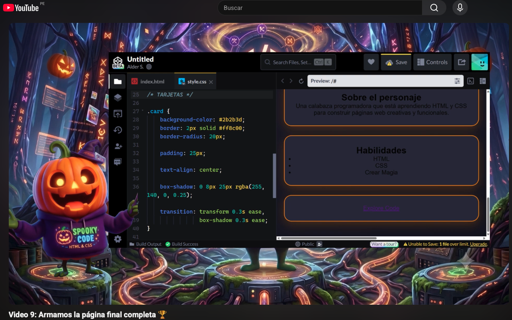
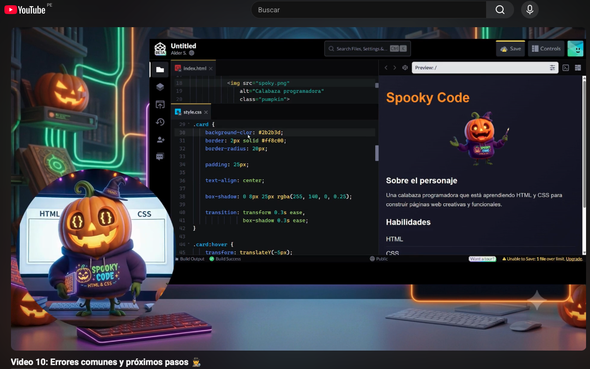

# 🎃 ¡Bienvenidos a Fundamentos de Desarrollo Web!

¡Hola! Qué genial que estés aquí. En este curso introductorio vas a aprender a crear tu propia página web desde cero usando HTML y CSS. No vas a tener que instalar absolutamente nada aburrido ni complicado; todo lo haremos directamente en tu navegador usando **CodePen**.

🦇 *Proyecto desarrollado para el curso de Aplicaciones Web - Ingeniería de Software - UPC (Periodo 202610).*
**Equipo InnovaTech:**
* Lopez Monroy, Rodrigo Alfredo (U202421866)
* Luis Miranda, Diego Andres (U20241D185)
* Mamani Vilca, Alan Jaivi (U20241E299)
* Pillaca Gonzales, Andy Saúl (U202418823)
*
 
**📂 Repositorio de código fuente**: [https://github.com/InnovaTechStudio/webdev-course-innovatech](https://github.com/InnovaTechStudio/webdev-course-innovatech/tree/main)

* **Público objetivo**: Estudiantes de 12 a 17 años sin experiencia en programación
* **Prerrequisitos**: Ninguno
* **Herramientas necesarias**: **¡Solo tu navegador web!** (Chrome, Firefox, Safari, Edge)

A lo largo de estos 10 videos cortos, iremos construyendo juntos una página web personal. ¡Sigue el paso a paso y diviértete programando!

---

## 👻 Lecciones del Curso

### Video 1: ¿Qué es una página web?

En este video descubriremos cómo funciona el internet y qué piezas construyen las páginas que visitas todos los días.
* 🎥 **Ver video:** https://www.youtube.com/watch?v=NqtE2ZFR3yI

### Video 2: Abrimos CodePen y hacemos la primera mini página

¡Es hora de poner las manos en el teclado! Conoceremos nuestra herramienta de trabajo y escribiremos nuestras primeras líneas.
* 🎥 **Ver video:** https://www.youtube.com/watch?v=2pgz3bColSQ
* 🕸️ **Herramienta:** [Abre CodePen y prepárate para crear](https://codepen.io/)

### Video 3: Etiquetas HTML básicas

Empezamos a darle forma a nuestro sitio usando títulos, subtítulos y párrafos.
* 🎥 **Ver video:** https://www.youtube.com/watch?v=70NvjB_4lbo
* 📜 **Plantilla para practicar:** [Abre la plantilla inicial](https://codepen.io/editor/pen?template=019ecc8f-ff51-7c46-b0b9-c4602d0368c7)
* 🎃 **Estado completado:** [Mira el código resuelto](https://codepen.io/editor/Rodrigo-L-pez-the-encoder/pen/019ecc91-8fe7-724d-8543-108068c78509)

### Video 4: Listas, enlaces e imágenes

Vamos a nutrir nuestra web agregando nuestros gustos en forma de lista, imágenes geniales y links a otras páginas.
* 🎥 **Ver video:** https://www.youtube.com/watch?v=T413CE3BBxI
* 📜 **Plantilla para practicar:** [Abre la plantilla inicial](https://codepen.io/editor/pen?template=019ecc91-cc08-7c77-b9ac-9774e588aac6)
* 🎃 **Estado completado:** [Mira el código resuelto](https://codepen.io/editor/Rodrigo-L-pez-the-encoder/pen/019ecc92-4354-7601-8759-80996b3e9106)

### Video 5: CSS: selectores, colores y fuentes

Llegó el momento de pintar nuestra página. Aprenderemos cómo usar CSS para cambiar colores y tipos de letra.
* 🎥 **Ver video:** https://www.youtube.com/watch?v=8LRuReNmpK4
* 📜 **Plantilla para practicar:** [Abre la plantilla inicial](https://codepen.io/editor/pen?template=019ecc92-fcec-7c8b-aa07-ea48d1c8d271)
* 🎃 **Estado completado:** [Mira el código resuelto](https://codepen.io/editor/Rodrigo-L-pez-the-encoder/pen/019ecc94-1ea0-76bc-8947-3c4b8dd1ad6e)

### Video 6: Tarjetas, bordes y espacios

Crearemos "tarjetas" visuales bonitas usando bordes redondeados y espacios para ordenar nuestra información.
* 🎥 **Ver video:** https://www.youtube.com/watch?v=qmlgZNvY-nU
* 📜 **Plantilla para practicar:** [Abre la plantilla inicial](https://codepen.io/editor/pen?template=019ecc94-78fa-7cb0-8f8f-4c323ae47eca)
* 🎃 **Estado completado:** [Mira el código resuelto](https://codepen.io/editor/Rodrigo-L-pez-the-encoder/pen/019ecc95-217c-76cf-9252-5be207017102)

### Video 7: Centrar y ordenar contenido

¡Nuestra página necesita un poco de orden! Haremos que todo se vea limpio y centrado en la pantalla.
* 🎥 **Ver video:** https://www.youtube.com/watch?v=FiNW-0dHT48
* 📜 **Plantilla para practicar:** [Abre la plantilla inicial](https://codepen.io/editor/pen?template=019ecc97-cef1-7cfa-a8f3-312f13940e1e)
* 🎃 **Estado completado:** [Mira el código resuelto](https://codepen.io/editor/Rodrigo-L-pez-the-encoder/pen/019ecc98-243f-742e-bb07-35d0563f641c)

### Video 8: Botones y efecto hover

Transformaremos un enlace aburrido en un botón interactivo que cambia de color cuando pasas el mouse por encima.
* 🎥 **Ver video:** https://www.youtube.com/watch?v=fYpzmCn4Bhk
* 📜 **Plantilla para practicar:** [Abre la plantilla inicial](https://codepen.io/editor/pen?template=019ecc98-623c-7d09-8911-d0fd2ca59c90)
* 🎃 **Estado completado:** [Mira el código resuelto](https://codepen.io/editor/Rodrigo-L-pez-the-encoder/pen/019ecc98-e5a6-709b-b1a3-1c04cd5360df)

### Video 9: Armamos la página final completa

Unimos todas las piezas. Es tu turno de personalizar todo lo que construimos con tu propia información y gustos.
* 🎥 **Ver video:** https://www.youtube.com/watch?v=9dl55-AW7Ws
* 📜 **Plantilla para practicar:** [Abre la plantilla inicial](https://codepen.io/editor/pen?template=019ecc99-2f5b-7d13-8966-ea96702e97c9)
* 🎃 **Estado completado:** [Mira el código resuelto](https://codepen.io/editor/Rodrigo-L-pez-the-encoder/pen/019ecc9a-2d43-779f-b234-05310437cd8a)

### Video 10: Errores comunes y próximos pasos

¡Conviértete en un detective de código! Aprenderemos a encontrar fallos, solucionarlos y te daremos consejos para seguir aprendiendo.
* 🎥 **Ver video:** https://www.youtube.com/watch?v=_BqDFQ8nPS0
* 📜 **Plantilla para practicar:** [Abre la plantilla inicial](https://codepen.io/editor/pen?template=019ecc9b-1623-7d47-8026-5ce13068c725)
* 🎃 **Estado completado:** [Mira el código resuelto](https://codepen.io/editor/Rodrigo-L-pez-the-encoder/pen/019ecc9b-cd56-73bd-93e2-b88bf15403ec)

---
